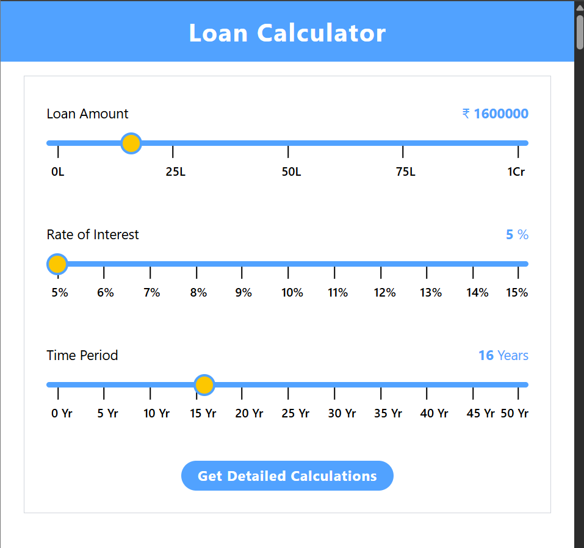
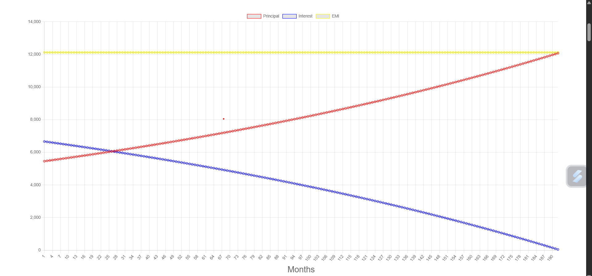
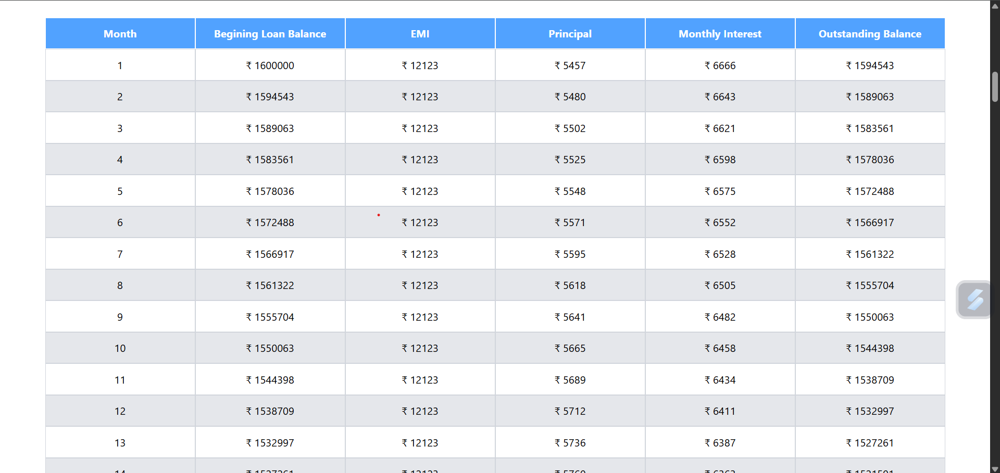

# Loan Calculator in which user can input principal amount, time period and rate of interest. User can see his emis, total interests, graph related to input data and loan detailed table.

 
 

 
 

 
 

