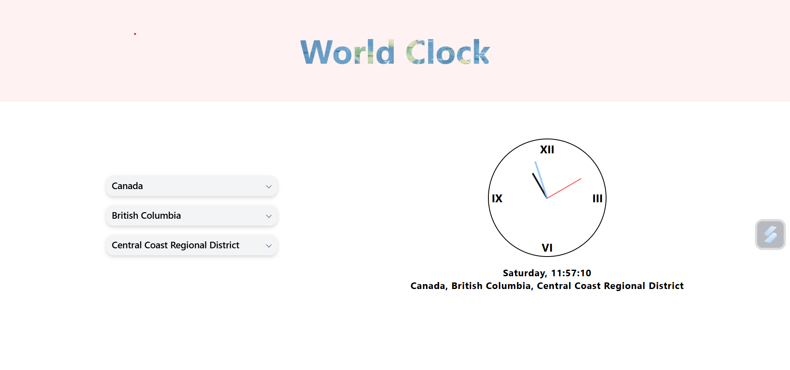
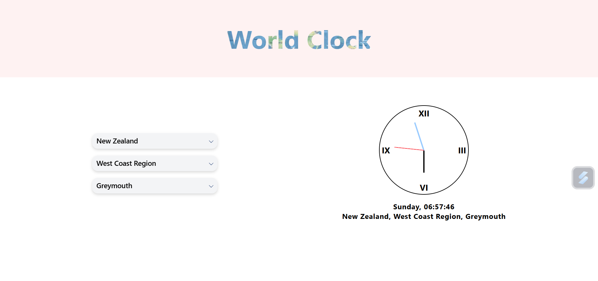

# World Clock where user can input country, state and city to get the time and clock and time will be displayed based on input data.

# Country-State-City api is used to fetch the names of country, state and city.

 
 

 
 

